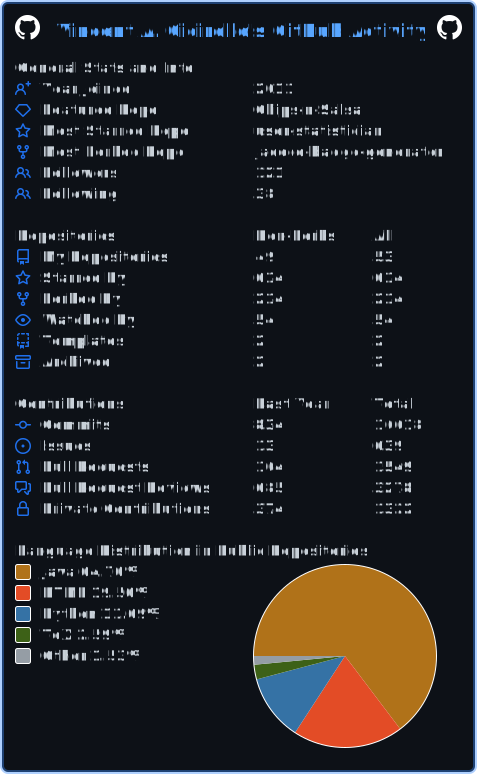

# Vincent A Cicirello

| | Sites where you can find me or my work |
| :--- | :--- |
| __Web and social media__ |    |
| __Software development__ |     |
| __Publications__ |        |

If you want to generate the equivalent to the above for your own GitHub profile,
check out the [cicirello/user-statistician](https://github.com/cicirello/user-statistician)
GitHub Action.

<!--
**cicirello/cicirello** is a ✨ _special_ ✨ repository because its `README.md` (this file) appears on your GitHub profile.

Here are some ideas to get you started:

- 🔭 I’m currently working on ...
- 🌱 I’m currently learning ...
- 👯 I’m looking to collaborate on ...
- 🤔 I’m looking for help with ...
- 💬 Ask me about ...
- 📫 How to reach me: ...
- 😄 Pronouns: ...
- ⚡ Fun fact: ...
-->
